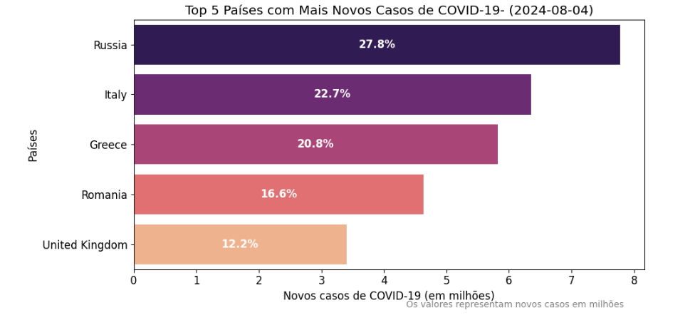
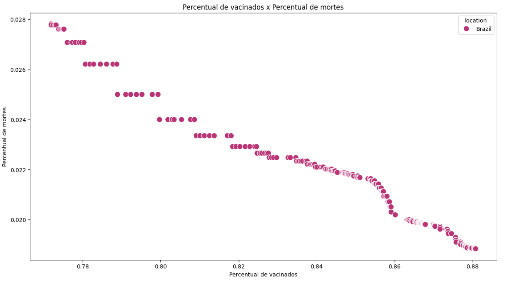
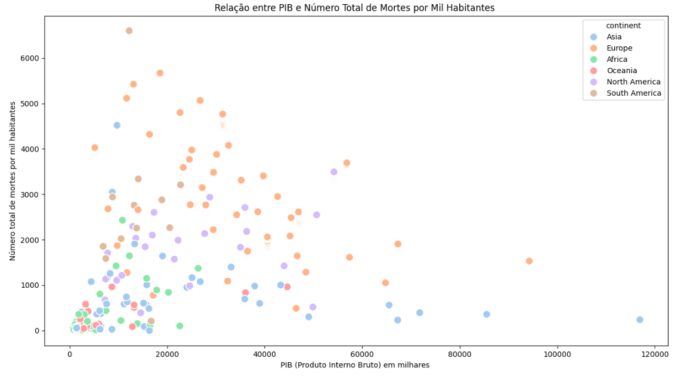
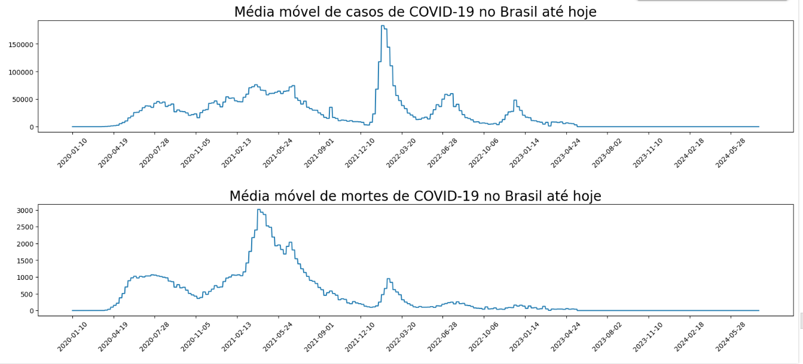
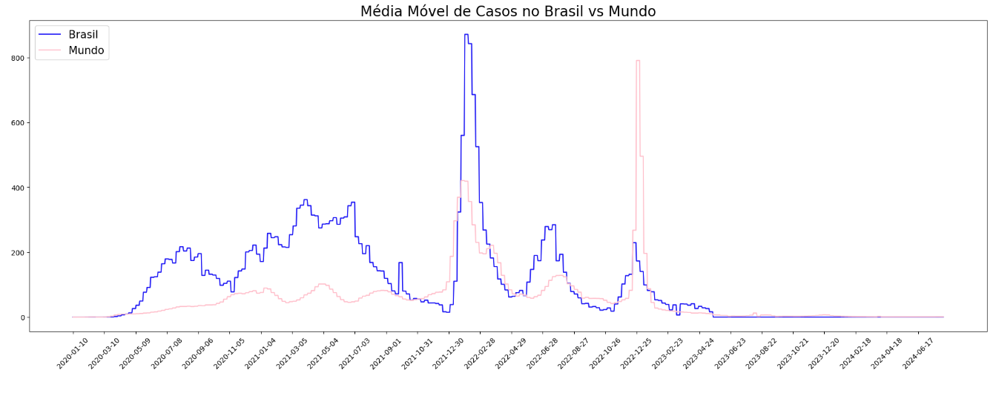

<p align="center">  </p>

# **Análise de Dados global da COVID-19**


## **📊 Sobre o Projeto**

A motivação para este projeto surgiu da necessidade de entender melhor como diferentes políticas públicas impactaram a evolução da pandemia de COVID-19 ao redor do mundo. Com o avanço da crise sanitária, governos adotaram estratégias diversas, desde lockdowns rigorosos até campanhas intensivas de vacinação. No entanto, medir a real efetividade dessas ações requer uma análise profunda de dados, cruzando variáveis como número de casos, mortalidade e taxas de vacinação.


## **📒 Dados Utilizados**

Os dados utilizados foram extraídos do repositório oficial do Our World in Data, garantindo informações atualizadas e confiáveis.

## **🔧 Tecnologias Utilizadas**
- Python
- Pandas
- Matplotlib
- Seaborn
- Google Colab (para execução dos notebooks)

## **Dicionário das variáveis**

- `aged_65_older`: Parcela da população com 65 anos ou mais, ano mais recente disponível
- `aged_70_older`: Parcela da população com 70 anos ou mais em 2015
- `cardiovasc_death_rate`: Taxa de mortalidade por doença cardiovascular em 2017 (número anual de mortes por 100.000 pessoas)
- `continent`: Continente da localização geográfica
- `date`: Data da observação
- `diabetes_prevalence`: Prevalência de diabetes (% da população de 20 a 79 anos) em 2017
- `extreme_poverty`: Percentual da população que vive em extrema pobreza, ano mais recente disponível desde 2010
- `female_smokers`: Proporção de mulheres que fumam, ano mais recente disponível
- `gdp_per_capita`: Produto interno bruto em paridade de poder de compra (dólares internacionais constantes de 2011), ano mais recente disponível
- `handwashing_facilities`: Percentagem da população com instalações básicas de lavagem das mãos nas instalações, ano mais recente disponível
- `hospital_beds_per_thousand`: Camas hospitalares por 1.000 pessoas, ano mais recente disponível desde 2010
- `hosp_patients`: Número de pacientes com COVID-19 no hospital em um determinado dia
- `hosp_patients_per_million`: Número de pacientes com COVID-19 no hospital em um determinado dia por 1.000.000 de pessoas
- `human_development_index`: Um índice composto que mede o desempenho médio em três dimensões básicas do desenvolvimento humano – uma vida longa e saudável, conhecimento e um padrão de vida decente.
- `icu_patients`: Número de pacientes com COVID-19 em unidades de terapia intensiva (UTIs) em um determinado dia
- `icu_patients_per_million`: Número de pacientes com COVID-19 em unidades de terapia intensiva (UTIs) em um determinado dia por 1.000.000 de pessoas
- `iso_code`: Código do país de três letras
- `life_expectancy`: Expectativa de vida ao nascer em 2019
- `location`: Localização geográfica
- `male_smokers`: Proporção de homens que fumam, ano mais recente disponível
- `median_age`: Idade média da população, projeção da ONU para 2020
- `new_cases`: Novos casos confirmados de COVID-19. As contagens podem incluir casos prováveis, quando relatados.
- `new_cases_per_million`: Novos casos confirmados de COVID-19 por 1.000.000 de pessoas. As contagens podem incluir casos prováveis, quando relatados.
- `new_cases_smoothed`: Novos casos confirmados de COVID-19 (suavizado de 7 dias). As contagens podem incluir casos prováveis, quando relatados.
- `new_cases_smoothed_per_million`: Novos casos confirmados de COVID-19 (suavizado em 7 dias) por 1.000.000 de pessoas. As contagens podem incluir casos prováveis, quando relatados.
- `new_deaths`: Novas mortes atribuídas ao COVID-19. As contagens podem incluir mortes prováveis, quando relatadas.
- `new_deaths_per_million`: Novas mortes atribuídas ao COVID-19 por 1.000.000 de pessoas. As contagens podem incluir mortes prováveis, quando relatadas.
- `new_deaths_smoothed`: Novas mortes atribuídas ao COVID-19 (suavizado de 7 dias). As contagens podem incluir mortes prováveis, quando relatadas.
- `new_deaths_smoothed_per_million`: Novas mortes atribuídas ao COVID-19 (suavizado de 7 dias) por 1.000.000 de pessoas. As contagens podem incluir mortes prováveis, quando relatadas.
- `new_people_vaccinated_smoothed`: Número diário de pessoas que recebem sua primeira dose de vacina (suavizado de 7 dias)
- `new_people_vaccinated_smoothed_per_hundred`: Número diário de pessoas que recebem sua primeira dose de vacina (suavizado de 7 dias) por 100 pessoas na população total
- `new_tests`: Novos testes para COVID-19 (calculado apenas para dias consecutivos)
- `new_tests_per_thousand`: Novos testes para COVID-19 por 1.000 pessoas
- `new_tests_smoothed`: Novos testes para COVID-19 (suavizado de 7 dias). Para países que não relatam dados de teste diariamente, assumimos que os testes mudaram igualmente diariamente em todos os períodos em que nenhum dado foi relatado. Isso produz uma série completa de números diários, que são então calculados em uma janela contínua de 7 dias
- `new_tests_smoothed_per_thousand`: Novos testes para COVID-19 (suavizado de 7 dias) por 1.000 pessoas
- `new_vaccinations`: Novas doses de vacinação COVID-19 administradas (calculadas apenas para dias consecutivos)
- `new_vaccinations_smoothed`: Novas doses de vacinação COVID-19 administradas (suavizado por 7 dias). Para países que não relatam dados de vacinação diariamente, assumimos que a vacinação mudou igualmente diariamente em todos os períodos em que nenhum dado foi relatado. Isso produz uma série completa de números diários, que são então calculados em uma janela contínua de 7 dias
- `new_vaccinations_smoothed_per_million`: Novas doses de vacinação COVID-19 administradas (suavizadas em 7 dias) por 1.000.000 de pessoas na população total
- `new_vaccinations_smoothed_per_thousand`: Novas doses de vacinação


 # **Análise Global 🌎**
 
- Quais são os cinco países com o maior número de casos de COVID-19?
<p align="center">  </p>
- Quais são os cinco países com o maior número de casos de COVID-19 atualmente? 
<p align="center">  </p>
- Qual o percentual de vacinados em relação às mortes do COVID-19?
<p align="center">  </p>
- Existe alguma correlação entre a parcela da população com mais de 65 anos e o percentual de mortes?
<p align="center">  </p>
- Existe alguma correlação entre o Produto Interno Bruto (PIB) de um país e o número total de mortes? 
<p align="center">  </p>
- Qual a média de casos e mortes globalmente da COVID-19? 
<p align="center">  </p>
- Qual é o continente com a maior mortalidade de idosos?
<p align="center">  </p>
------------------------------------------------------------------------------------

<p align="center">  </p>

# **Análise de dados: Brasil**


Nesta fase, concentraremos nossa análise no contexto brasileiro e procuraremos responder às seguintes questões:

- Qual foi a data do primeiro registro de caso de COVID-19 no Brasil?
  - O primeiro caso confirmado de COVID-19 no Brasil ocorreu em 26 de fevereiro de 2020.
    ```bash
    df_brasil.loc[df_brasil['total_cases'] == df_brasil['total_cases'].min()]['date'].min()
    ```
    ```bash
    Timestamp('2020-02-27 00:00:00')
    ```
- Qual foi a data do primeiro registro de morte por COVID-19 no Brasil?
  - A primeira morte por COVID-19 no Brasil foi registrada em 17 de março de 2020.
      ```bash
    df_brasil.loc[df_brasil['total_deaths'] == df_brasil['total_deaths'].min()]['date'].min()
    ```
    ```bash
    Timestamp('2020-03-18 00:00:00')
    ```
- Gráfico da média móvel dos casos e óbitos por COVID-19 no Brasil.
  <p align="center">  </p>
- Gráfico de linha mostrando a evolução do número de pessoas vacinadas no Brasil e a progressão das doses de reforço administradas.
<p align="center">  </p>
- Comparação da média móvel de casos e óbitos no Brasil com o cenário global.
<p align="center">  </p>

## **Desafios encontrados e como foram superados**

- **Coleta e tratamento de dados**
Inicialmente, encontrar um conjunto de dados confiável e atualizado foi um grande desafio. Para resolver isso, optei pelo repositório oficial da Our World in Data, que fornece informações padronizadas sobre a pandemia.

- **Manipulação de grandes volumes de dados**
Trabalhar com dados extensos exigiu técnicas de otimização, como uso de bibliotecas eficientes no Python, incluindo pandas e numpy. Além disso, utilizei Google Colab para facilitar a execução do código sem sobrecarregar minha máquina local.

- **Correlação entre políticas públicas e evolução da pandemia**
Um dos maiores desafios foi estabelecer conexões significativas entre os dados. Para isso, apliquei métodos estatísticos e utilizei visualizações gráficas com matplotlib e seaborn, o que ajudou a identificar padrões importantes.

- **Interpretação dos resultados**
Analisar os dados além dos números foi essencial para extrair insights relevantes. Para garantir conclusões bem fundamentadas, consultei pesquisas científicas e artigos sobre os efeitos de lockdowns e vacinação na contenção do vírus.

## **Considerações Finais ✨🔍📊**
Esta análise forneceu insights tanto a nível global quanto local, utilizando um conjunto de dados fornecido pelo Our World in Data, que incluía informações sobre o número de casos e mortes em cada país, a parcela da população com idade acima de 65 anos, o PIB do país, entre outros dados relevantes. É importante ressaltar que essa análise é uma abordagem superficial e exploratória, focada no estudo, e os números foram observados em termos absolutos, o que pode influenciar os resultados finais.

*Algumas observações podem ficar desatualizadas devido aos relatórios contínuos da COVID-19. No entanto, com base na análise até o dia 24/08/2024 (última atualização), as informações são:*

- Os países com mais casos absolutos de COVID-19 são, em ordem: Estados Unidos, Índia, Brasil, França e China. Juntos, eles representam 41% de todos os casos registrados globalmente.
- No último registro disponível, os países com mais casos são: Rússia, Grécia, România, Inglaterra e Itália.
- Os países com mais mortes absolutas por COVID-19 são: Estados Unidos, Índia, Brasil, França e China.
- No último registro disponível, os países com mais mortes registradas são: Estados Unidos, Índia, Brasil, França e China.
- Os países com o maior número absoluto de pessoas vacinadas são: Índia, Estados Unidos, Brasil, Indonésia e China.
- A variável aged_65_older, que representa a parcela da população com mais de 65 anos, tem uma correlação de 15.06% com o número total de mortes.
- A variável gdp_per_capita, que representa o PIB do país, tem uma correlação de 2.29% com o número total de mortes.
- O primeiro caso confirmado de COVID-19 no Brasil ocorreu em 26 de fevereiro de 2020.
- A primeira morte por COVID-19 no Brasil foi registrada em 17 de março de 2020.
- A média móvel de casos no país teve um pico devido à variante ômicron, mas a média móvel de mortes não acompanhou um aumento considerável.
- A porcentagem de pessoas que receberam pelo menos a primeira dose da vacina e a quantidade de doses de reforço aplicadas têm aumentado ao longo do tempo.
- Há uma correlação negativa entre o aumento da porcentagem de pessoas vacinadas e a diminuição do percentual de mortes.

Esta análise oferece uma visão inicial dos dados disponíveis e pode servir como ponto de partida para investigações mais aprofundadas sobre os fatores que influenciam a propagação e o impacto da COVID-19 em diferentes países.

🛠️ ## **Como Executar**

**Clone este repositório:**
```bash
git clone https://github.com/seu-usuario/seu-repositorio.git
```
**Instale as dependências necessárias:**
```bash
pip install pandas matplotlib seaborn
```
**Execute o notebook no Google Colab ou localmente**


📚 ## **Referências**

https://raw.githubusercontent.com/owid/covid-19-data/master/public/data/owid-covid-data.csv

Agradeço pela visita ao repositório e convido você a acompanhar o progresso deste projeto. Para mais informações ou para discutir colaborações, sinta-se à vontade para me contatar pelo meu [LinkedIn](https://www.linkedin.com/in/giulia-bugatti-fonseca-226955267).

