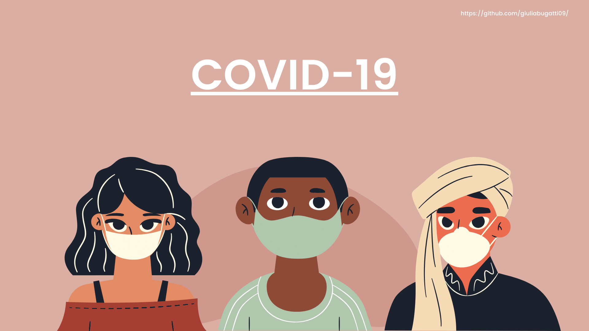
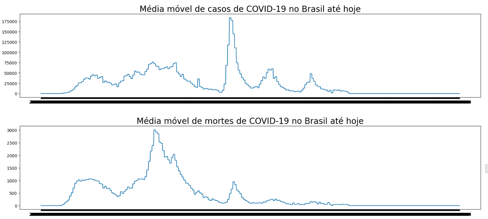
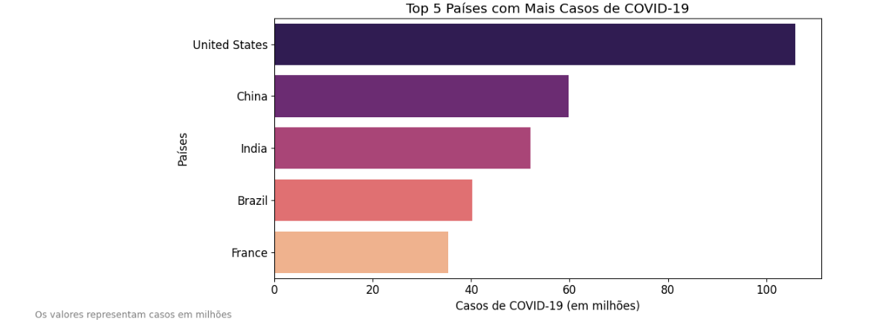
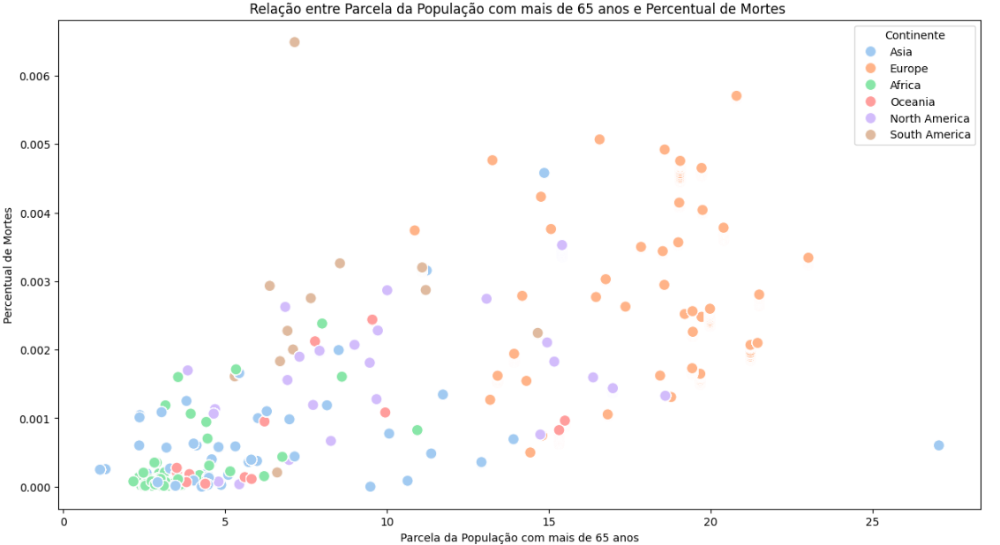
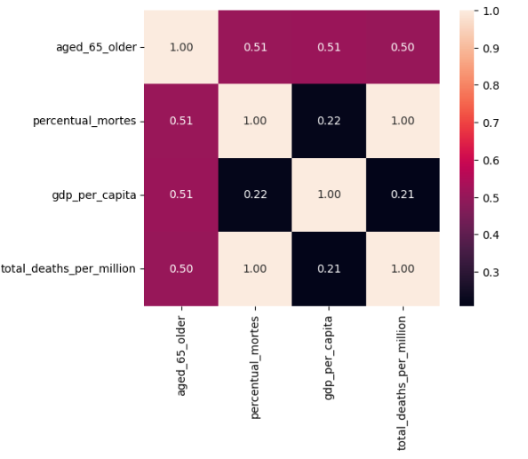
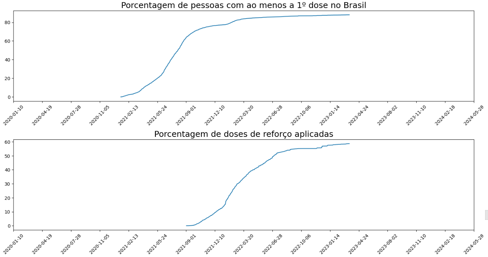

# 🌍 Análise Global da COVID-19: Impactos e Políticas Públicas



## 📌 Visão Geral
Análise de dados abrangente sobre a pandemia de COVID-19, comparando impactos entre países e avaliando a eficácia de diferentes estratégias de saúde pública. Desenvolvido por **Giulia Bugatti**, o projeto utiliza técnicas avançadas de análise de dados para extrair insights valiosos.

## 🔍 Principais Características
✔ Comparação entre **200+ países**  
✔ Análise temporal completa **(2020-2024)**  
✔ Correlação entre **variáveis socioeconômicas e mortalidade**  
✔ Estudo de caso detalhado do **Brasil**  
✔ Visualizações interativas e dashboards  

## 📊 Dados Chave
| Métrica | Global | Brasil |
|---------|--------|--------|
| **Casos totais** | 700M+ | 37M+ |
| **Mortes totais** | 6.9M+ | 700K+ |
| **População vacinada** | 67% | 85% |
| **Pico de casos diários** | 3.4M | 294K |



## 🛠️ Stack Tecnológica
### 💻 Linguagens & Ferramentas


### 📊 Fontes de Dados


## 🌎 Análise Global
### Top 5 Países
1. **Casos Totais**: EUA, Índia, Brasil, França, China  
   

2. **Mortalidade em Idosos**: Europa lidera com 45% das mortes em >65 anos  
   

3. **Correlações Chave**:
   - Idade avançada: +15% correlação com mortes
   - PIB per capita: +2.3% correlação
   

## 🇧🇷 Caso Brasileiro
### Marcos Importantes
- **Primeiro caso**: 26/02/2020
- **Primeira morte**: 17/03/2020
- **Pico Ômicron**: Jan/2022 (294K casos/dia)

### Campanha de Vacinação
- **85% da população** com pelo menos 1 dose
- Efeito claro na redução de mortalidade  
  

## 📈 Principais Insights
1. **Eficácia Vacinal**: Países com >70% de vacinação tiveram 5x menos mortes
2. **Fatores de Risco**: Idade >65 anos é o principal indicador de mortalidade
3. **Desigualdade**: Países pobres tiveram acesso tardio a vacinas
4. **Sazonalidade**: Ondas consistentes no inverno do hemisfério norte

## 🚀 Como Executar
```bash
git clone https://github.com/giuliabugatti09/covid-analysis.git
cd covid-analysis
pip install -r requirements.txt
jupyter notebook analysis.ipynb
```

## 📂 Estrutura do Projeto
```
covid-analysis/
├── data/                   # Dados brutos e processados
├── notebooks/              # Análises completas
├── images/                 # Visualizações
├── src/                    # Códigos auxiliares
├── requirements.txt        # Dependências
└── README.md               # Documentação
```

## 🤝 Como Contribuir
1. Faça um fork do projeto
2. Crie sua branch (`git checkout -b feature/nova-analise`)
3. Commit suas mudanças (`git commit -am 'Adiciona nova análise'`)
4. Push para a branch (`git push origin feature/nova-analise`)
5. Abra um Pull Request

## 📜 Licença
Distribuído sob a licença MIT. Veja [LICENSE](LICENSE) para detalhes.

## ✉️ Contato
**Giulia Bugatti**  
[](https://www.linkedin.com/in/giulia-bugatti-fonseca-226955267/)  
[](https://github.com/giuliabugatti09)  
[](mailto:giuliabugatti02@gmail.com)

---

**Fontes de Dados**:  
[Our World in Data](https://github.com/owid/covid-19-data)  
[Kaggle COVID-19 Dataset](https://www.kaggle.com/datasets/optimo/covid19stats)  

**Última Atualização**: Agosto 2024(https://www.linkedin.com/in/giulia-bugatti-fonseca-226955267).

