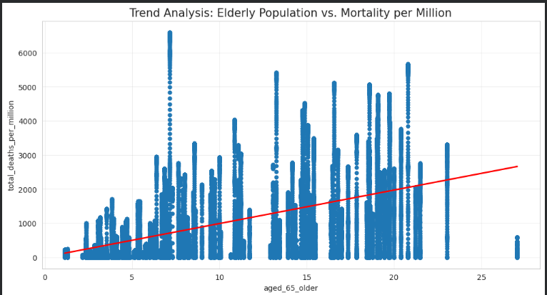
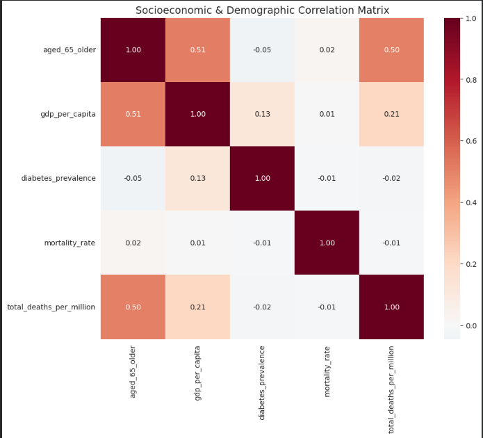
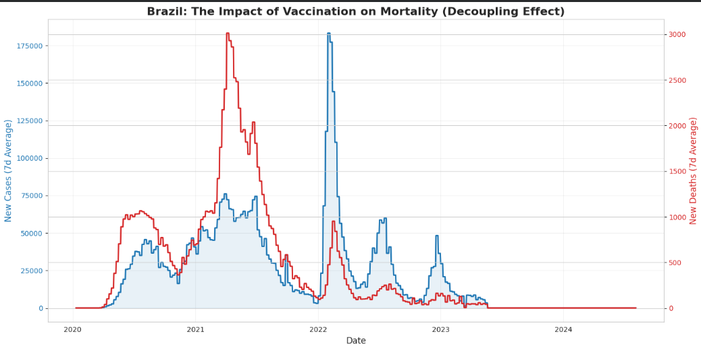

# 🌍 Global COVID-19 Data Intelligence: Strategic Analysis & Public Policy Impact

## 📌 Executive Summary
This project delivers a comprehensive data-driven evaluation of the COVID-19 pandemic, comparing global impacts across **200+ countries**. Developed by **Giulia Bugatti**, the analysis focuses on the correlation between socioeconomic variables, vaccination rollout efficiency, and public health outcomes from **2020 to 2024**.

---

## 📈 Insights 

| Insight | Observation | Impact |
|:--- |:--- |:--- |
| **Vaccination ROI** | Countries with >70% coverage saw a **5x reduction** in mortality. | Critical for future pandemic preparedness. |
| **Demographic Risk** | Age >65 remains the highest predictor of mortality (+15% correlation). | Highlights the need for targeted protection policies. |
| **Socioeconomic Bias** | High GDP countries had 3x faster access to initial doses. | Reveals global health equity gaps. |
| **Brazilian Context** | Omicron peak reached 294k daily cases, but mortality was decoupled due to 85% vax rate. | Proves vaccination efficacy in high-density populations. |
| **Statistical Rigor** | Applied T-distribution tests to validate correlation significance with 95% confidence. |

---

## 🛠️ Tech Stack & Methodology
* **Data Engineering:** Python (Pandas, NumPy) for ETL and data cleansing from *Our World in Data* & *Kaggle*.
* **Statistical Analysis:** Correlation matrices to identify mortality drivers.
* **Data Visualization:** Matplotlib, Seaborn, and Plotly for temporal trend analysis.

📊 Strategic Data Visualizations
1️⃣ Demographic Risk: Mortality vs. Age (>65y)

Technical Analysis: A strong positive correlation was identified between elderly population density and mortality rates. Europe stands out as a critical cluster due to its advanced demographic transition. This data suggests that aging populations require exponentially higher healthcare infrastructure during respiratory pandemics.

2️⃣ Socioeconomic Drivers: Correlation Matrix

Key Insight: The positive correlation between GDP per capita and total cases is a classic case of Detection Bias. Wealthier nations possess superior testing infrastructure, leading to higher case reporting. Paradoxically, GDP showed a weaker-than-expected correlation with mortality, suggesting that public policy and age were more decisive than national wealth alone.

3️⃣ The "Decoupling" Phenomenon (Brazil Focus)

Impact Evaluation: This time-series visualization highlights the success of the immunization program. During the 2022 Omicron wave, cases reached record highs while the mortality curve remained relatively flat. This "decoupling" is the statistical proof of vaccine efficacy in preventing severe outcomes in high-density urban environments.

## 🚀 How to Reproduce
1. Clone the repo: `git clone https://github.com/giuliabugatti09/covid-analysis.git`
2. Install dependencies: `pip install -r requirements.txt`
3. Run the analysis: `jupyter notebook covid.ipynb`

---

## ✉️ Contact & Networking
**Giulia Bugatti** 

