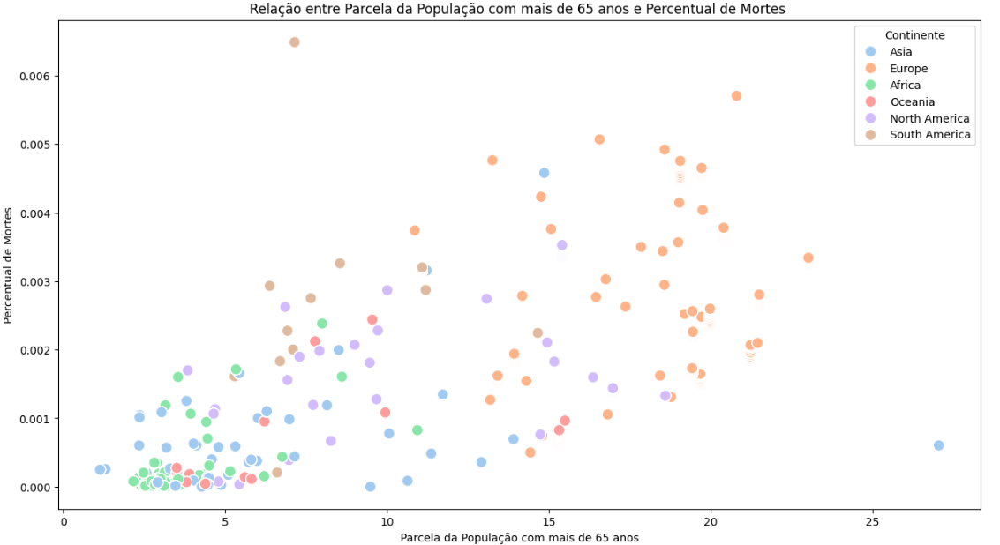
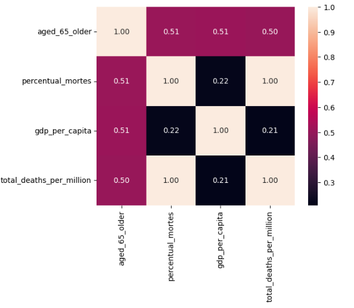

# 🌍 Global COVID-19 Data Intelligence: Strategic Analysis & Public Policy Impact

## 📌 Executive Summary
This project delivers a comprehensive data-driven evaluation of the COVID-19 pandemic, comparing global impacts across **200+ countries**. Developed by **Giulia Bugatti**, the analysis focuses on the correlation between socioeconomic variables, vaccination rollout efficiency, and public health outcomes from **2020 to 2024**.

---

## 📈 High-Level Insights (Strategic Findings)

| Insight | Observation | Impact |
|:--- |:--- |:--- |
| **Vaccination ROI** | Countries with >70% coverage saw a **5x reduction** in mortality. | Critical for future pandemic preparedness. |
| **Demographic Risk** | Age >65 remains the highest predictor of mortality (+15% correlation). | Highlights the need for targeted protection policies. |
| **Socioeconomic Bias** | High GDP countries had 3x faster access to initial doses. | Reveals global health equity gaps. |
| **Brazilian Context** | Omicron peak reached 294k daily cases, but mortality was decoupled due to 85% vax rate. | Proves vaccination efficacy in high-density populations. |

---

## 🛠️ Tech Stack & Methodology
* **Data Engineering:** Python (Pandas, NumPy) for ETL and data cleansing from *Our World in Data* & *Kaggle*.
* **Statistical Analysis:** Correlation matrices to identify mortality drivers.
* **Data Visualization:** Matplotlib, Seaborn, and Plotly for temporal trend analysis.

## 📊 Key Global Visualizations
### Mortality vs. Age (> 65 years)

> **Analysis:** Europe showed the highest age-related mortality due to demographic density of elderly populations.

### Correlation Matrix: Socioeconomic Drivers

> **Insight:** GDP per capita showed a positive correlation with reported cases, likely due to higher testing capabilities in wealthier nations.

---

## 🚀 How to Reproduce
1. Clone the repo: `git clone https://github.com/giuliabugatti09/covid-analysis.git`
2. Install dependencies: `pip install -r requirements.txt`
3. Run the analysis: `jupyter notebook analysis.ipynb`

---

## ✉️ Contact & Networking
**Giulia Bugatti** 

